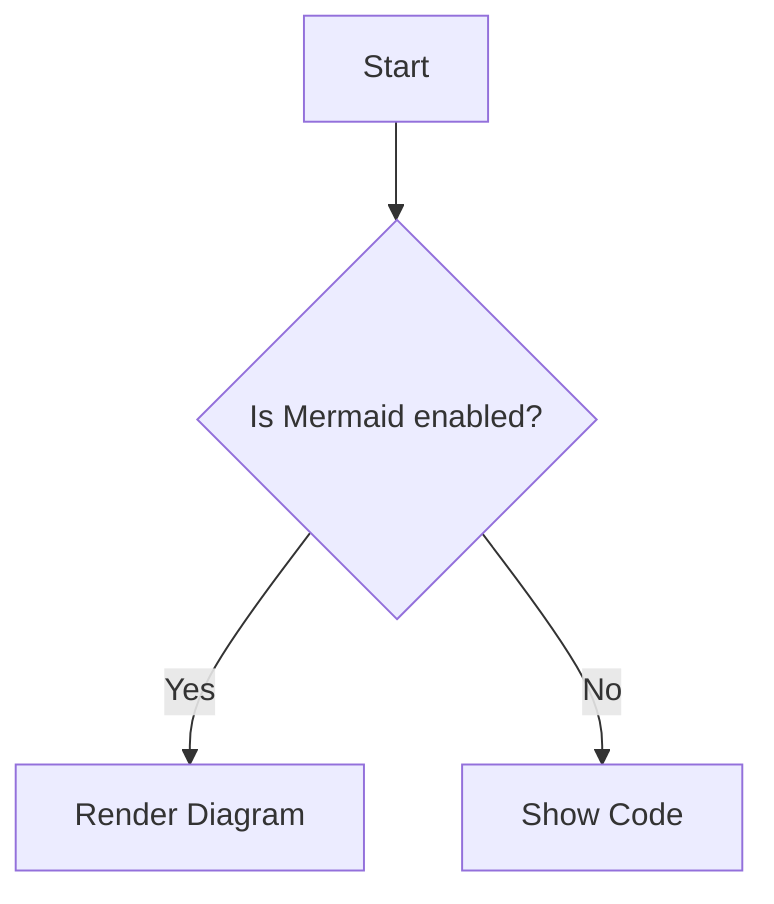
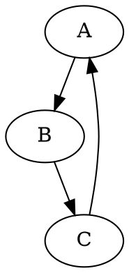
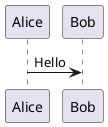

# Diagram Support Test

## Mermaid Example

## Graphviz Example

## PlantUML Example

---

You should see a Mermaid diagram, a Graphviz diagram, and a PlantUML code block above. For PlantUML, use a PlantUML server or pre-rendered images for production.
