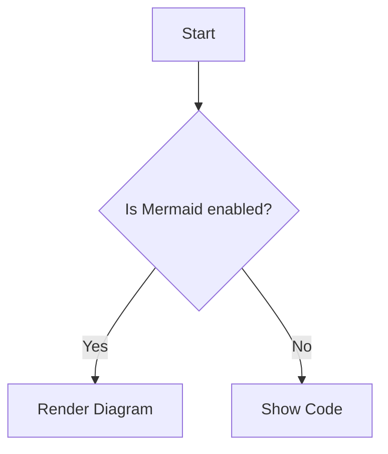
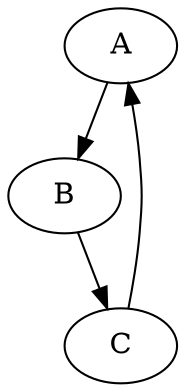
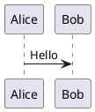

# Diagram Support in Markdown

Eldroid SSG supports rendering diagrams directly from markdown code blocks using the following types:

- **Mermaid** (`mermaid`)
- **Graphviz/Dot** (`graphviz` or `dot`)
- **PlantUML** (`plantuml`)

## Usage

### Mermaid
````markdown

````

### Graphviz (Dot)
````markdown

````

### PlantUML
````markdown

````

## How it works
- **Mermaid**: Rendered in-browser using Mermaid.js.
- **Graphviz**: Rendered in-browser using Viz.js.
- **PlantUML**: For best results, use a PlantUML server or pre-render diagrams. (Client-side JS rendering is not included by default, but you can extend support.)

## Best Practices
- Use fenced code blocks with the correct language tag.
- For PlantUML, you may use a PlantUML server to generate images and embed them with `` if needed.
- Diagrams are responsive and theme-aware.

## Example Output
See the [test_diagrams.md](../content/blog/test_diagrams.md) file for a live example.
